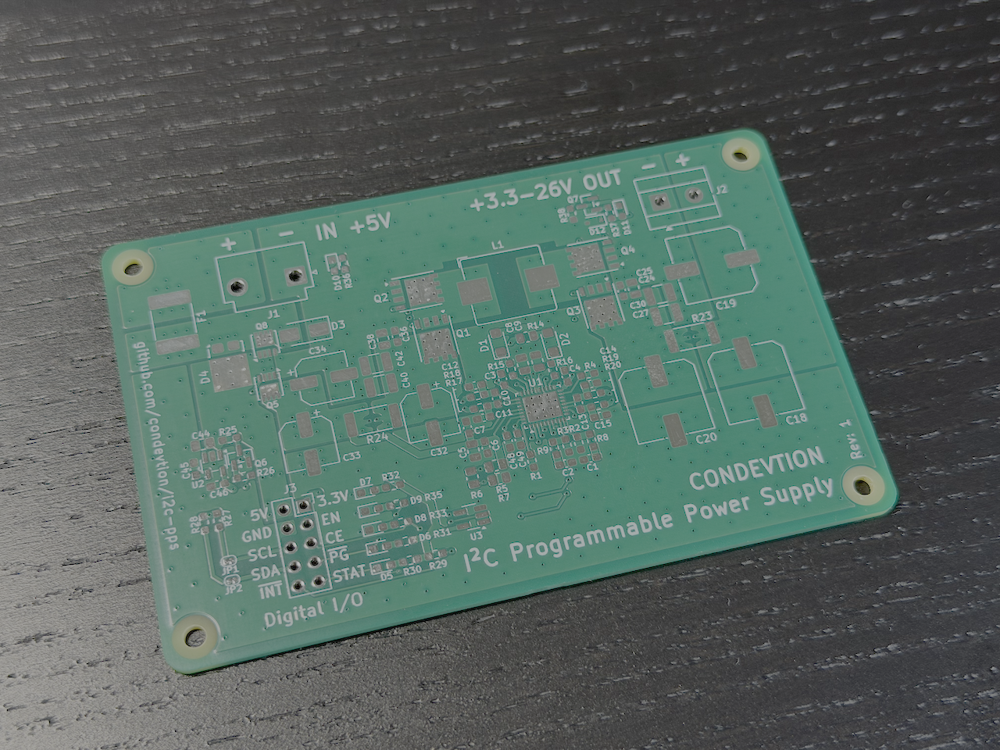
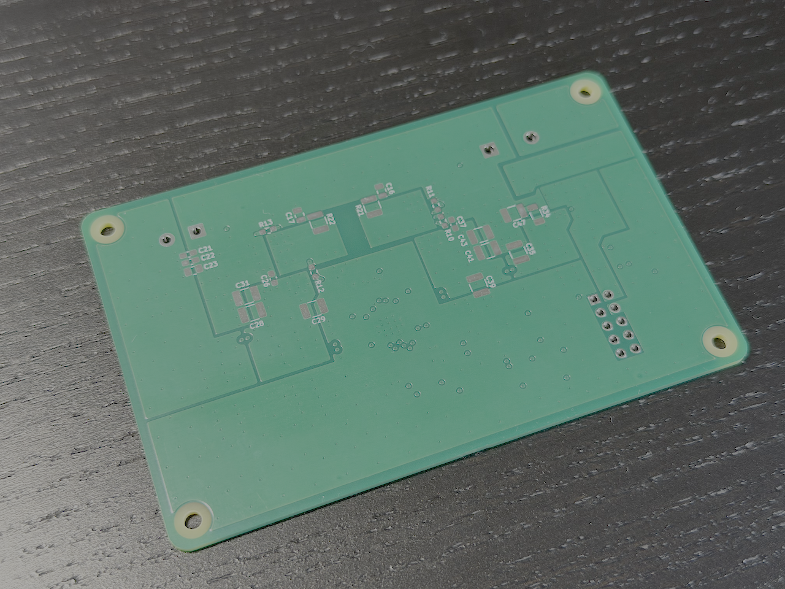
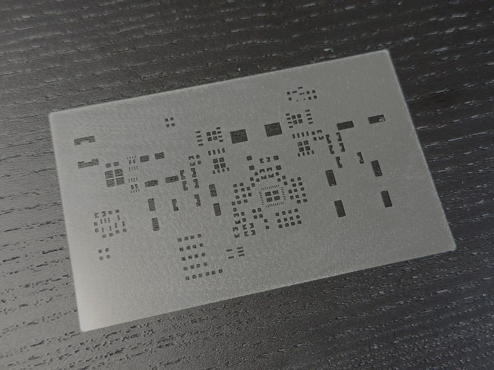

# Programmable DC-DC Power Supply with I2C Interface

## About
The repository gathers hardware, software, and management artifacts of the power supply development.

## Purpose
Compact Bench Power Supply controllable by [Raspberry Pi Zero 2 W](https://www.raspberrypi.com/products/raspberry-pi-zero-2-w/) and powered by the same AC-DC supply with enough power budged (for example, [MEAN WELL RS-35-5](https://www.meanwellusa.com/webapp/product/search.aspx?prod=RS-35)).

## Publications
* [Part 1 - Idea](https://github.com/condevtion/i2c-pps/tree/main/reports/01.%20Idea) Feb 15, 2026. Describes the project motivation
* [Part 2 - Planning](https://github.com/condevtion/i2c-pps/tree/main/reports/02.%20Planning) Feb 18, 2026. Represents initial plan for device development
* [Part 3 - Schematics Boilerplate](https://github.com/condevtion/i2c-pps/tree/main/reports/03.%20Schematics%20Boilerplate) Feb 21, 2026. KiCAD Schematics Skeleton
* [Part 4 - Schematics](https://github.com/condevtion/i2c-pps/tree/main/reports/04.%20Schematics) Feb 27, 2026. Complete Schematics
* [Part 5 - BOM](https://github.com/condevtion/i2c-pps/tree/main/reports/05.%20BOM) Mar 8, 2026. Selection of the Market available components
* [Part 6 - PCB](https://github.com/condevtion/i2c-pps/tree/main/reports/06.%20PCB) Apr 12, 2026. Complete PCB design

## Specifications
- Controller: Texas Instruments [BQ25758S](https://www.ti.com/product/BQ25758S)
- Input voltage: 5V (4-6V - hardware power good window)
- Input current: up to 5A (hardware limited)
- Output voltage: programmable by I2C in controller defined range (3.3 - 26V)
- Output current: up to 5A (hardware limited)
- Switching frequency: 250kHz

## Components
Using calculator spreadsheets ([BQ25756_DESIGN-CALC-V01X4 (Low, 250).xlsx](BQ25756_DESIGN-CALC-V01X4%20(Low%2C%20250).xlsx) for lower and [BQ25756_DESIGN-CALC-V01X4 (High, 250).xlsx](BQ25756_DESIGN-CALC-V01X4%20(High%2C%20250).xlsx) for higher output voltage) selected following power stage components and programming resistor values.
- Power Stage:
  - Inductor: 10uH, Isat > 6.3A, DCR 1.75 - 60mOhm (for example, [SRP1038A-100M](https://www.bourns.com/docs/Product-Datasheets/SRP1038A.pdf))
  - Power MOSFETs: [SiR880BDP](https://www.vishay.com/docs/63031/sir880bdp.pdf) (TI Recommended)
- Input Sensor and Current Limit:
  - Sense Resistor: 5mOhm
  - Input Pull-down: 3.92k (limit 5A)
- Input Under/Over-voltage Programming Resistors (for 4-6V with 4.4V DPM limit):
  - Top: 1000k
  - Middle: 105k
  - Bottom: 274k
- Output Sensor and Current Limit:
  - Sense Resistor: 5mOhm
  - Output Pull-down: 10k (limit 5A)
- Mode Resistor: 3k (sets Buck-Boost mode)
- Capacitors: 3x47uF 35V (input), 3x56uF 80V (output), and set of ceramic capacitors to provide low ESR

As of Apr 7, 2026 BOM for one assembly contains 52 entry and costs $49.79. The same BOM total for 3 assemblies adjusted
for higher quantity offers is $110.84 or $36.95 per assembly ($133.88 with tax, tariff, and shipping) - [I2C-PPS BOM.csv](I2C-PPS%20BOM.csv).

## Schematics
Schematics are stored in a dedicated repository - [condevtion/i2c-pps-hw](https://github.com/condevtion/i2c-pps-hw).  The device is complex enough for the schematics to be split into several pages, one for each functional block.

The diagram above shows following blocks:
- Controller and Power Stage - consists of the BQ25758S controller, the power MOSFETs, and the inductor
- Input Filter and Sensor - a set of input capacitors and the input current sense resistor connected according to 4-point probes (Kelvin) method
- Output Filter and Sensor - the same for output circuit
- Master Switch - an input protection and an electronically controllable power switch
- Digital I/O - digital interface between controller and I2C host, contains as well a status LED, a power good LED, and an independent voltage regulator for the digital circuit
- Programming - a set of resistors to define controller's operating mode and HW limits for voltage and current

## Fabricated PCB and Stencil
Producing a batch of 5 copies of the printed circuit board and one stencil cost $128.51, including taxes, duties ($30.37), and express shipping with customs clearance ($34.82). The final result looks great to me. While I think that the stensil could be easier to deal with if it was a bit smaller, silkscreen text looks better than I expected for the smallest size possible.

### PCB Top

### PCB Bottom

### Stencil

