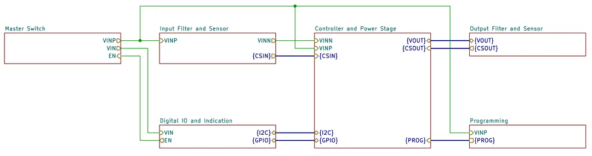
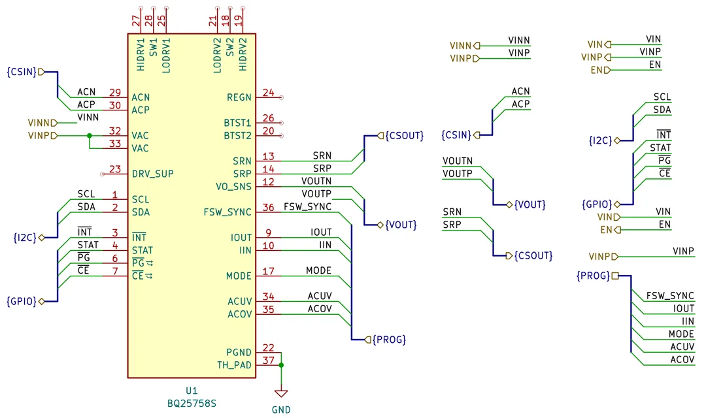

# Building I2C-PPS. Part 3 - Schematics Boilerplate

Having a particular plan for the power supply (as described in the posts before [part 2 - Planning](https://github.com/condevtion/i2c-pps/tree/main/reports/01.%20Idea) and [part 1 - Idea](https://github.com/condevtion/i2c-pps/tree/main/reports/02.%20Planning)) it's possible to start schematics itself. I use and really enjoy KiCAD - it has everything I need for my skills and projects I create.

As the first step with the schematics (see - [github.com/condevtion/i2c-pps-hw](https://github.com/condevtion/i2c-pps-hw)) I decided mostly to transform the diagram from the previous post to a set of pages and define networks and busses to connect them. You can see a screenshot of the root page in the first picture with the result. The second picture contains everything from the rest of the pages. It's not much for now - the controller's symbol, and a bunch of network and hierarchical labels to enable so called "sheet pins".

I made the symbol starting from one for BQ25798 existed in KiCAD's global library. The chip is quite different but it can be easily transformed by majorly editing pins. While the footprint and 3D model can be requested from Ultra Librarian site by like provided on TI page for BQ25758S. All symbols and footprints I usually add to local projects libraries just not to mess with global library.

In KiCAD its a bit tricky to create nice, short names for busses. You need to create aliases in "File" > "Schematic Setup" > "Bus Alias Definitions" and then you can use them across all pages of a project. For now I came up with following networks and busses:

* **VIN** \- positive input voltage. The master switch page should contain an input connector and protection circuit (fuse, TVS diode) after which the network starts. As well is used to power the digital I/O and indication block
* **VINP** \- positive input voltage after the master switch itself (goes to the input filter)
* **EN** \- master switch control signal (should be high to turn the switch on and low to turn it OFF)
* **VINN** \- output of the input filter
* **VOUT** \- the output voltages bus (contains power stage output and whole device output networks, goes to the output filter)
* **CSIN** \- the input current sensor bus (goes to ACN and ACP pins of the controller)
* **CSOUT** \- the output current sensor bus (goes to SRN and SRP pins)
* **I2C** \- I2C bus itself (connected to SCL and SDA pins)
* **GPIO** \- groups digital I/O lines: interrupt, power good, status, and chip enable
* **PROG** \- groups the rest of analog input lines which should be connected to the programming block to set operating mode and limits for the controller Maybe, going through detailed design these will require changes.

The next step is to draft every page with actual design probably skipping at first particular values for components.
