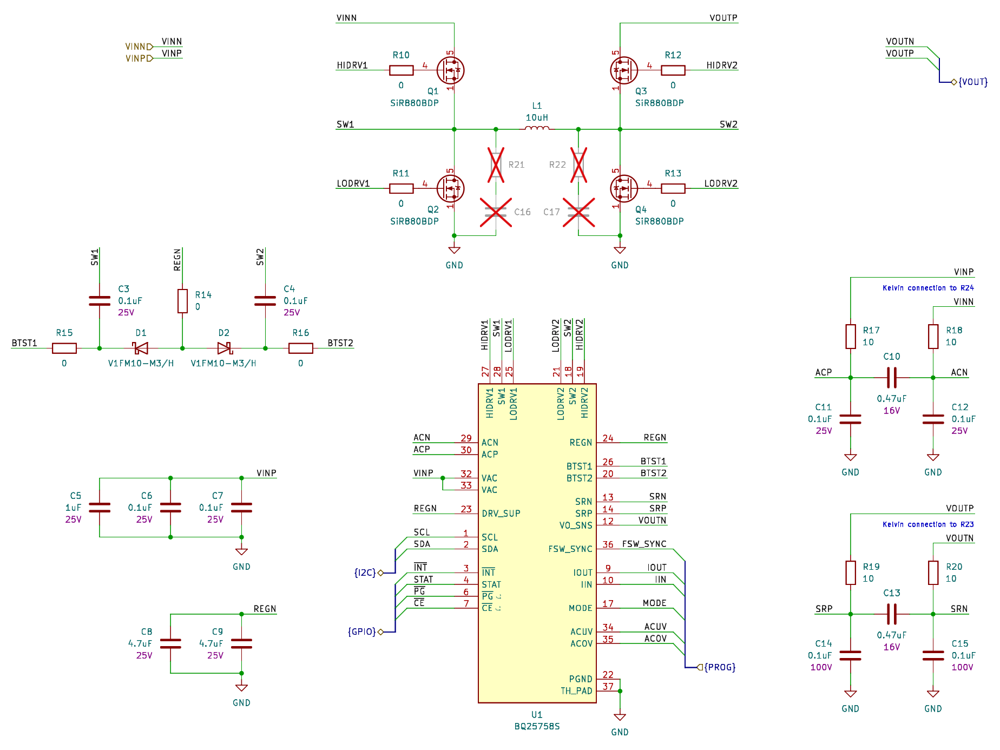
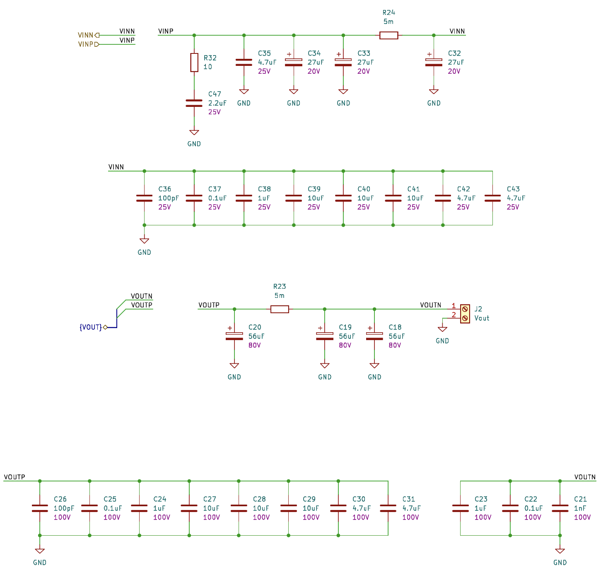
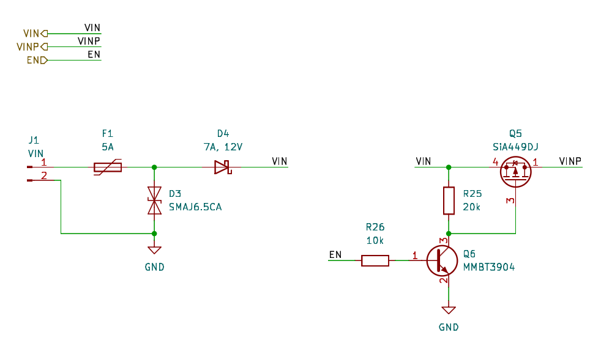
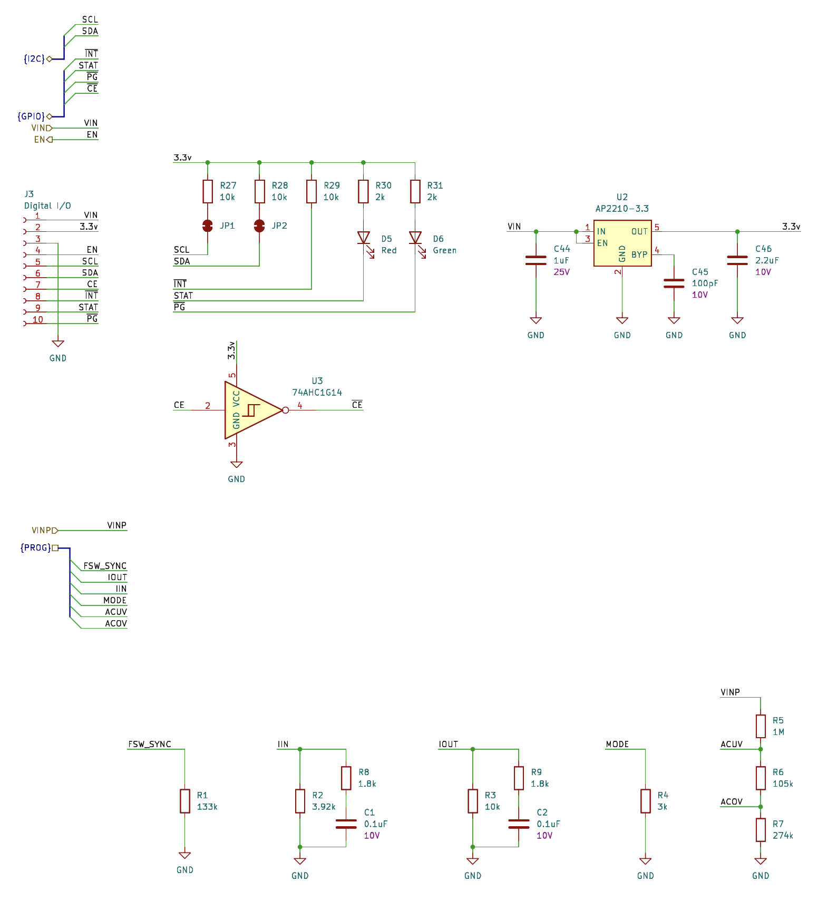

# Building I2C-PPS. Part 4 - Schematics

Designing actual schematics for the device took a while. It appears to require 56 distinct components and 101 in total (see repository - [condevtion/i2c-pps-hw](https://github.com/condevtion/i2c-pps)). Which is actually a huge project for me. A lot of useful information was there in the controller’s datasheet (obviously). But it isn’t really possible to get the design right without complimentary schematic checklist which can be found in the FAQ page. And some insides can be peeked from the evaluation board user guide. Still there are some mysteries to figure out in practice.

The first picture shows the controller and power stage block. Besides what name implies it shows components which should be placed near to the controller. The evaluation board guide mentions snubber networks for MOSFETs. For now they remain DNP as their values can be figured out only for particular PCB impedance which only can be obtained from measuring actual ringing. Also I left zero resisters here in case dv/dt requires adjustments (if the whole thing works, at the end of the day).

The second picture shows input and output filters and sensors. As I limited myself to 4-6V input and 5A max current (comparing to 20A the controller capability) I also relaxed requirements for the components here accordingly (while indeed 5A is still a hell of ambitions). In the other hand it’s probably better to have generally the same input and output components (obviously most capable) to have less number of distinct components to order.

 The next picture contains the master switch itself, and a protection circuit. The protection includes a resectable fuse, a TVS diode for overvoltage, and a Schottky diode for polarity. I’m looking forward to see how hot the latest gets at max current. The switch itself is a high side P-channel MOSFET controlled by a PNP transistor making a host device (RPI) to hold a pin high making the device in its turn work. If the host dies and drops its pin low the switch should turn off the device.

The last one shows the digital I/O and programming circuits. The I/O contains its very own low power regulator to be independent on the host system. I2C lines use solder jumpers to disconnect pull-ups if they are somewhere else (when several I2C devices connected to the bus). I just thought, I’d add several more LEDs to indicate presence of input, output, and other signals and make the thing more RGB.

The programming set of resistors just defines all adjustable controller parameters - switching frequency (250kHz), mode (buck-boost), and voltage/current limits. Curiously, the checklist and the evaluation board design show RC filters around IIN and IOUT resistors but don’t mention them or requirements for them anywhere.

All set to finalize the BOM with market-available parts and proceed with PCB design.
