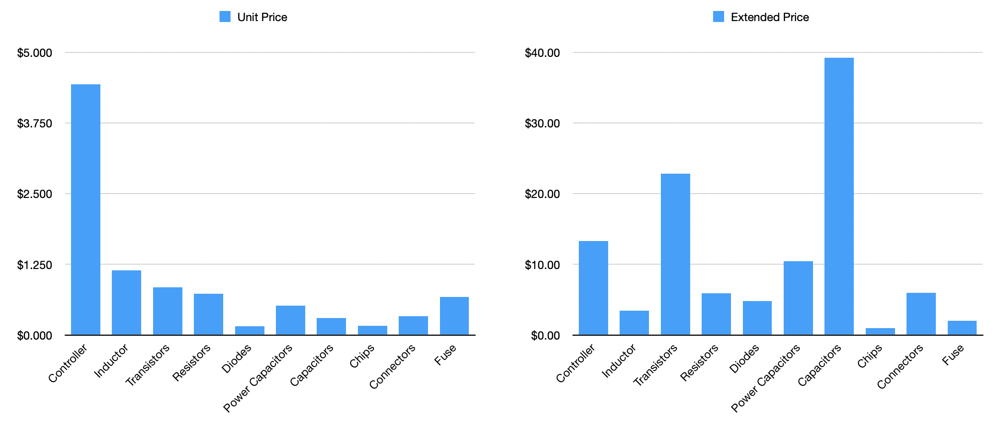
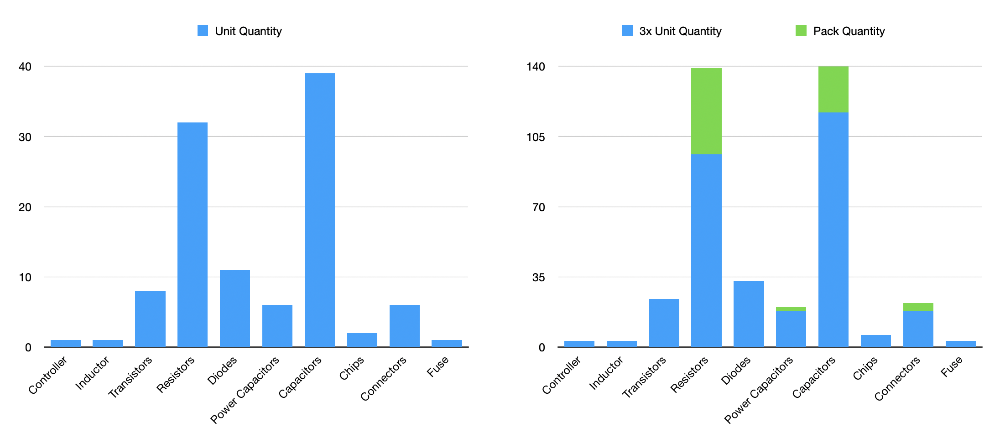

# Building I2C-PPS. Part 5 - BOM

This is the next update on the programmable power supply project (you can find previous posts and more details in its umbrella repository [condevtion/i2c-pps](https://github.com/condevtion/i2c-pps), while schematics itself is in [condevtion/i2c-pps-hw](https://github.com/condevtion/i2c-pps-hw)).

During the past week I managed to select exact market available components for the device and create detailed [BOM](https://github.com/condevtion/i2c-pps/blob/main/I2C-PPS%20BOM.csv). I need parts for 3 copies of the power supply - two sets to actually build devices and one on standby just in case. Honestly, I expected the BOM to be 3 times cheaper (or at least 2) but costs for hundred components quickly add up. In the first picture above (left chart) you can see average unit price of a part per its type with quite expected the BQ25758S controller being the most expensive thing. However, as the right chart shows total amount of capacitors easily gives them the lead in final cost, which is $108.88 (or $36.29 per set). For just one set the total is $48.99 making it almost buy two get one for free.

The next picture shows quantities of parts per device and totals for 3 devices with additional components (marked green) per part type (total here is 393 for all 3 sets). The latest allows to reduce cost even further due to substantially lower prices on bigger quantities.

Now, knowing exact parts and their footprints I can start designing PCB itself.
