# Building I2C-PPS. Part 6 - PCB

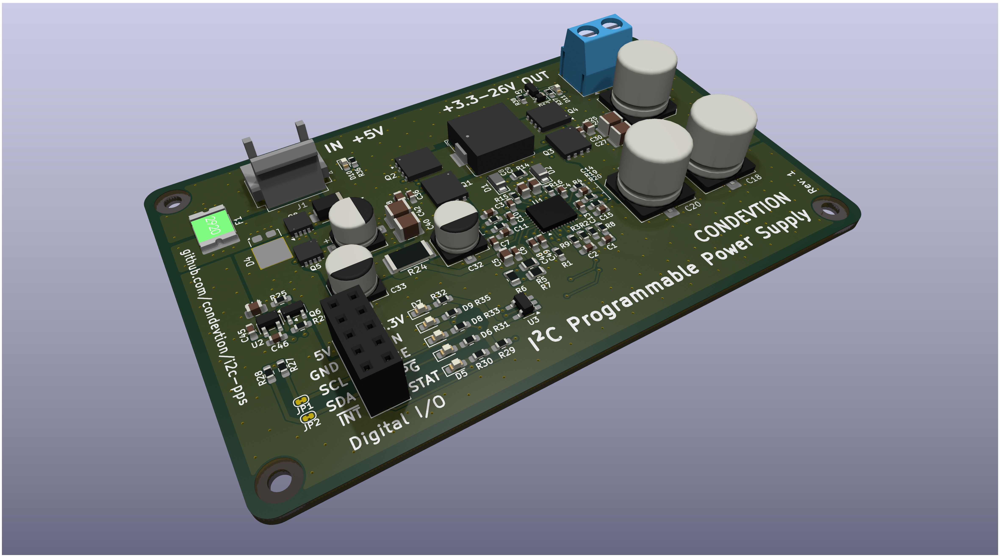

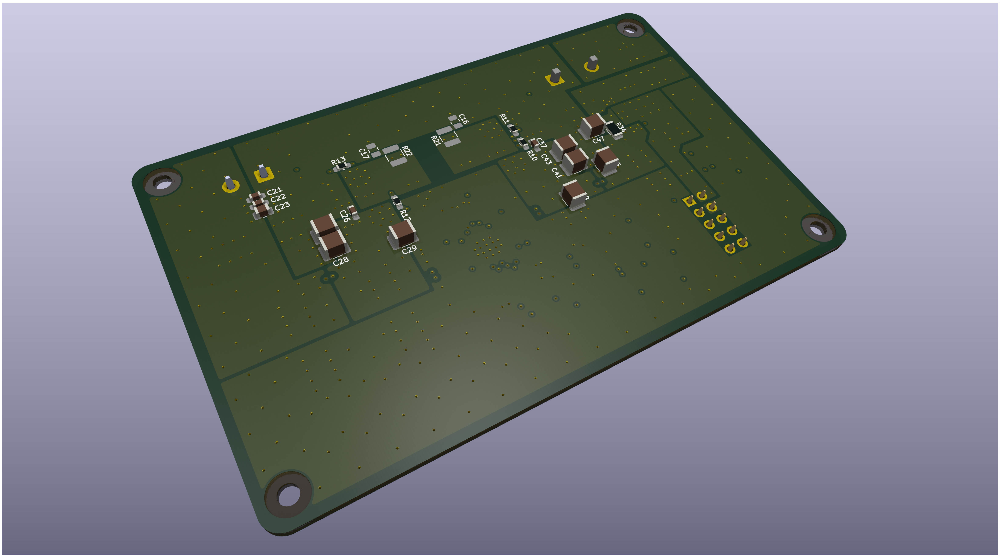

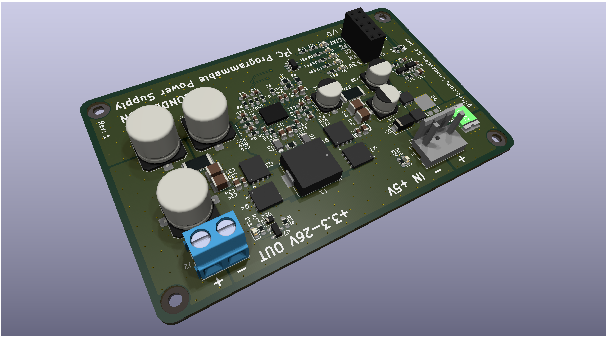

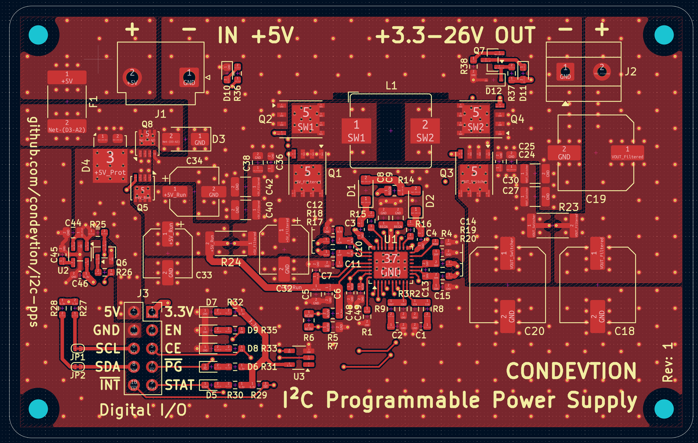

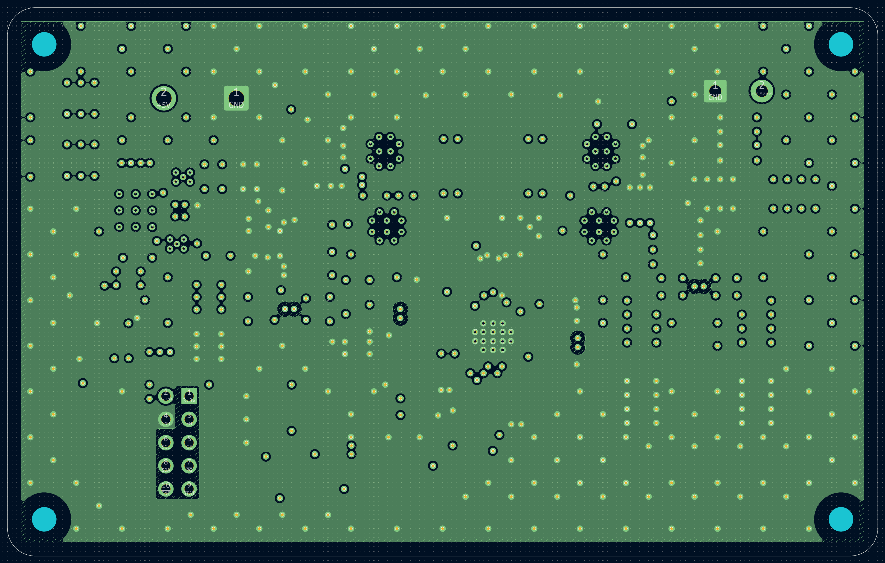

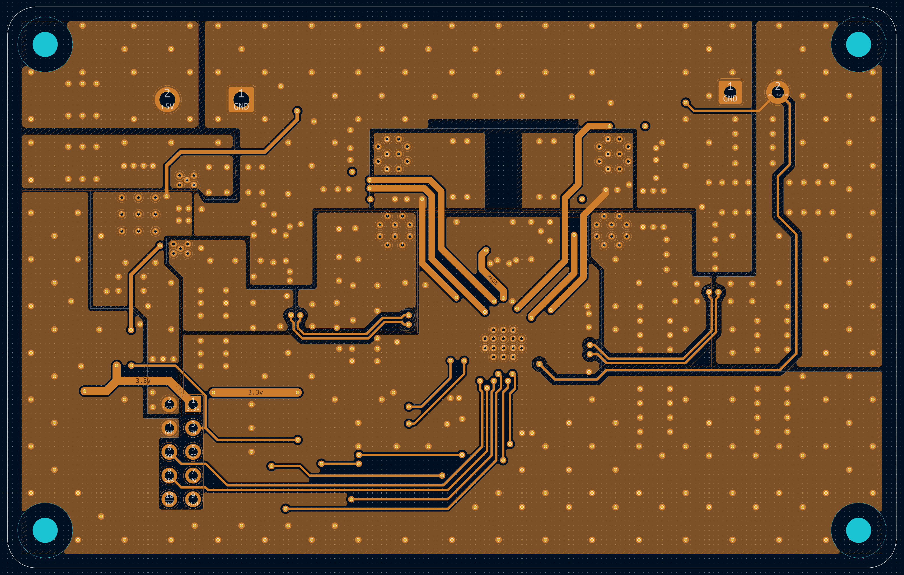

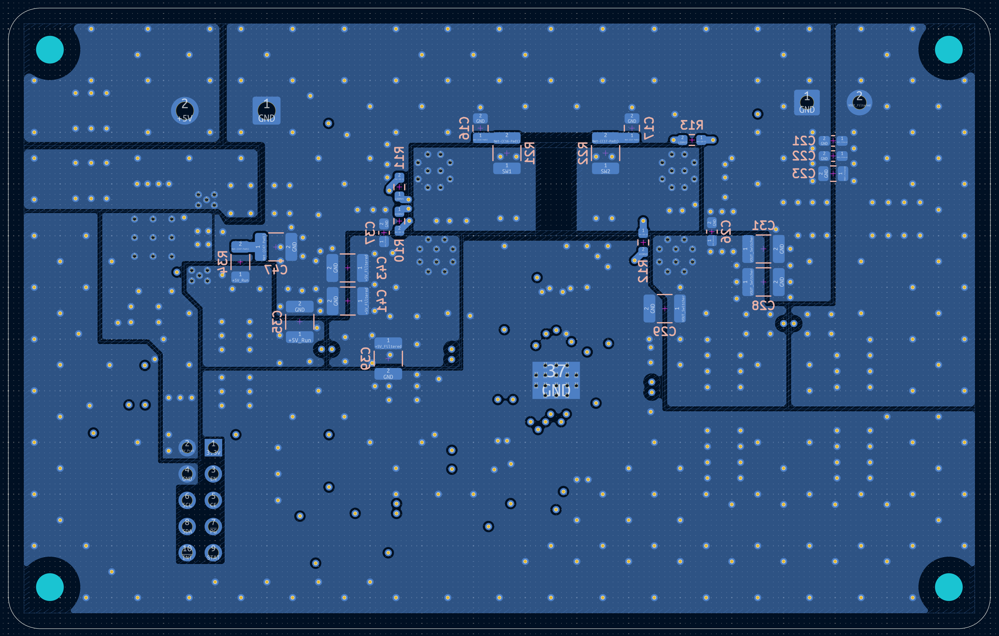

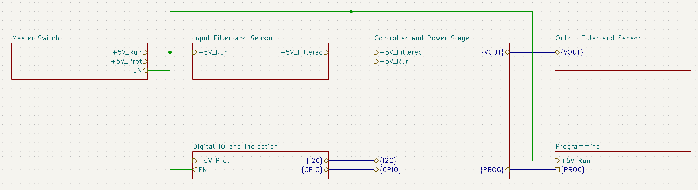

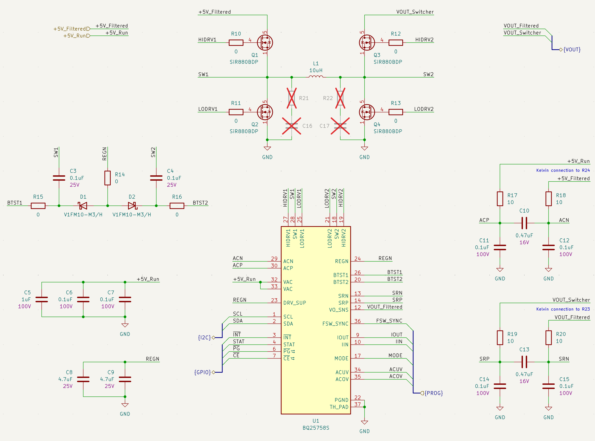

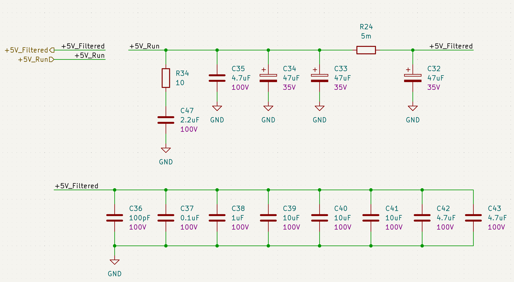

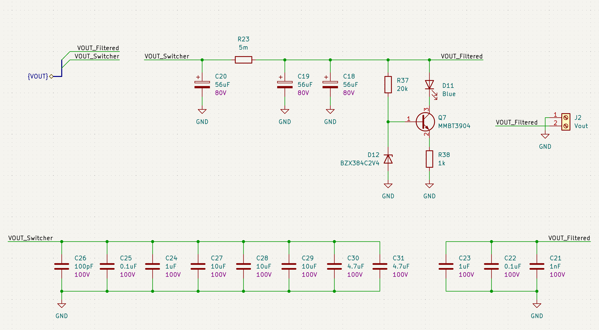

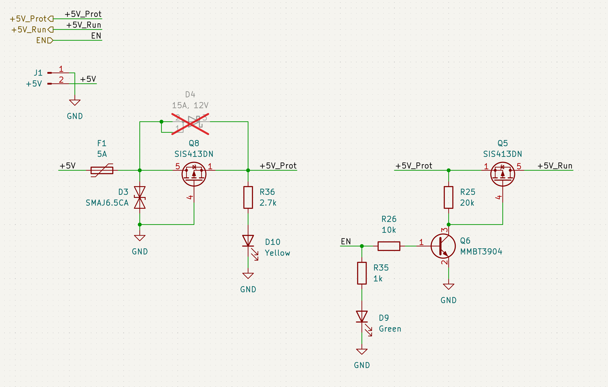

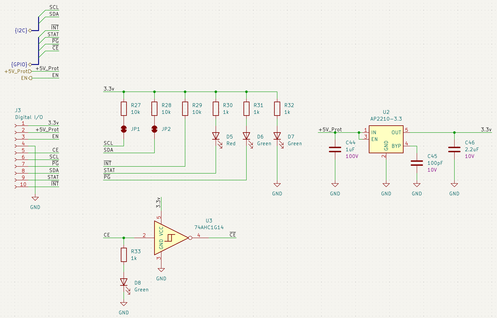

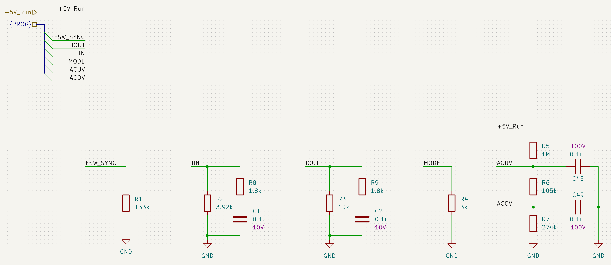

This is another update on the programmable power supply project (you can find [previous posts](https://github.com/condevtion/i2c-pps/tree/main/reports) and more details in its umbrella repository [condevtion/i2c-pps](https://github.com/condevtion/i2c-pps), while schematics itself is in [condevtion/i2c-pps-hw](https://github.com/condevtion/i2c-pps-hw)).

PCB design took a bit more than a month and far longer than I thought. It's even more than I estimated whole design phase initially. I weighted roughly that in a month from start I'd be able to send order to factory. Oh, you sweet summer child.

But it's finally done and you can see here attached 3D previews (first three pictures), stackup (the next four), and schematics (the rest). The stackup is quite simple - the top layer is mixed, the first inner layer is dedicated to ground, the second inner layer is signal routing, and bottom - power. Also I put schematics here for reference - root page, controller and power stage, input filter, output filter, protection and master switch, digital I/O, and programming resistors.

Before I started PCB design I thought that main challenge would be to fit whole thing into four layers. But for me the challenge was to stop myself from doing precise component placement and adjust traces before I had overall vision of the board. Probably, I spend a couple of weeks going into exact placement and routing and then deciding that I could do better if I took another approach. Still the approach with placing components per functional block far from each other and then brining whole board together pays off a lot.

It was surprisingly hard in KiCad to control distance between zones using its clearance and priority level. For example, a zone seem to ignore its own clearance while making space to a trace (but not via or pad). However, as there is a possibility to create rule areas with "keep out zone fills" from any graphics or track it doesn't make a problem.

Another notable thing about this device is a set of Kelvin connections. In the current version they are all the same networks as main connections of their respective components and it prevents DRC from alarming when there are overlaps. I thought it would be a right thing to make custom components with dedicated pins and pads for the connections which would allocate to them their own networks. But I triple checked manually. They all look good to me so I decided to leave them as they are.

As a final touch the digital I/O connector fit leds perfectly adding visual representation to all "human readable" outputs.

Now, a couple of real world steps reman - PCB manufacturing and assembly. The latest I'm going to DIY (actually, myself). And let see if it will work.
