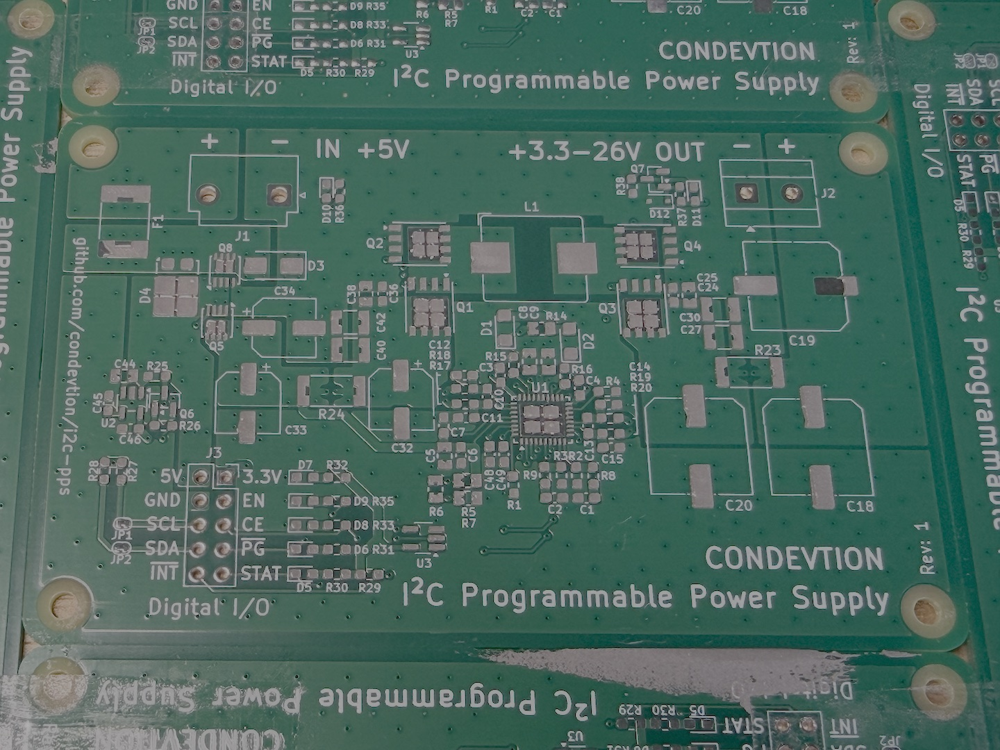
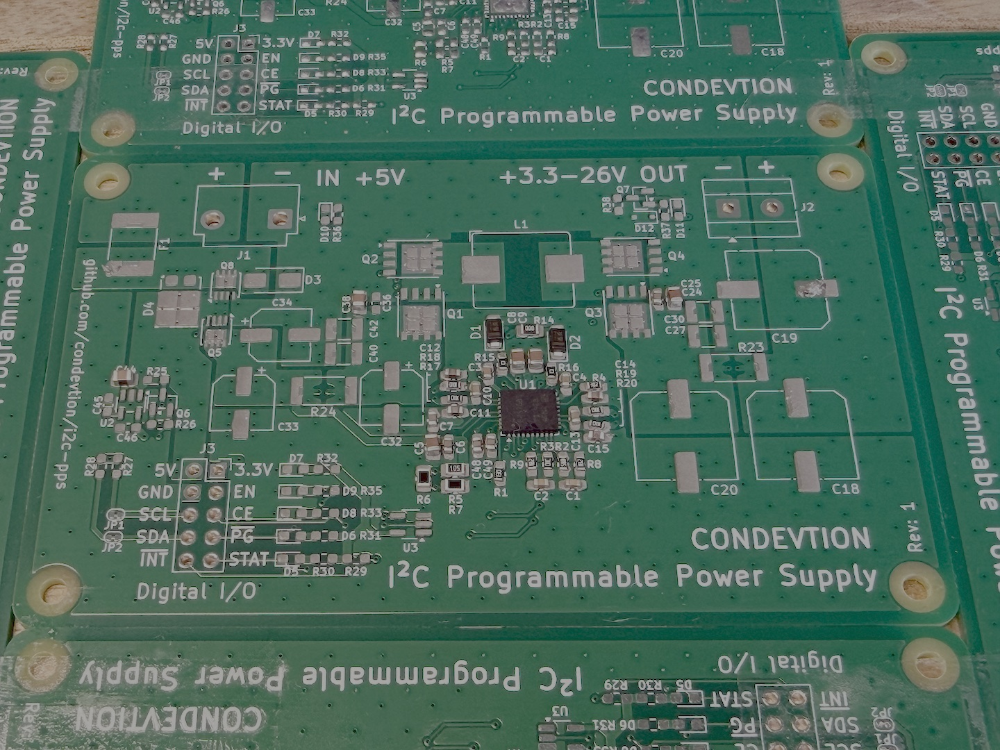
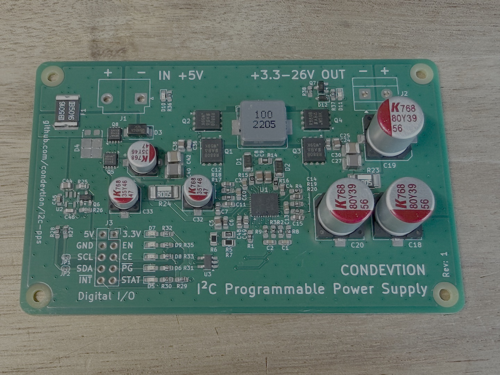
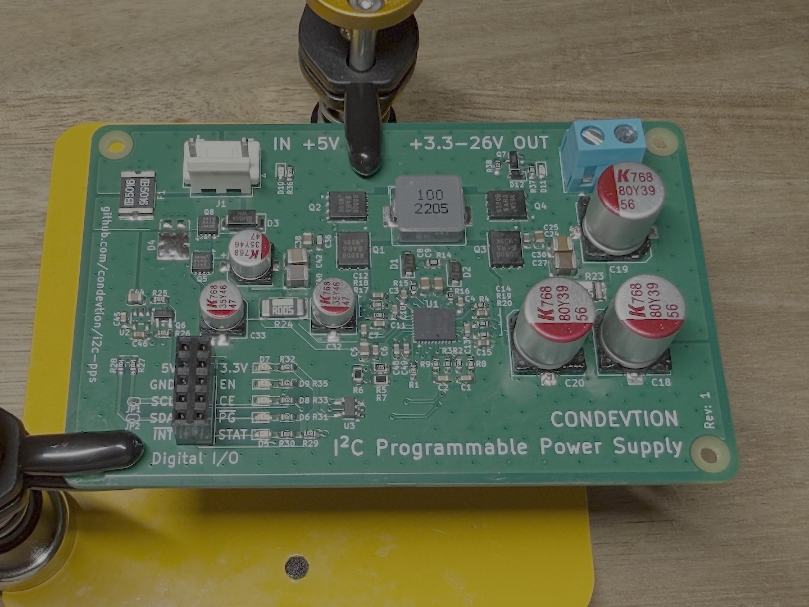
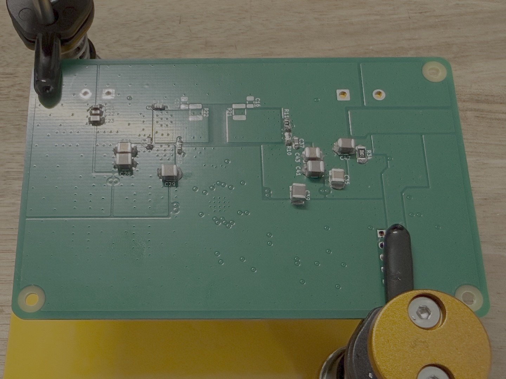
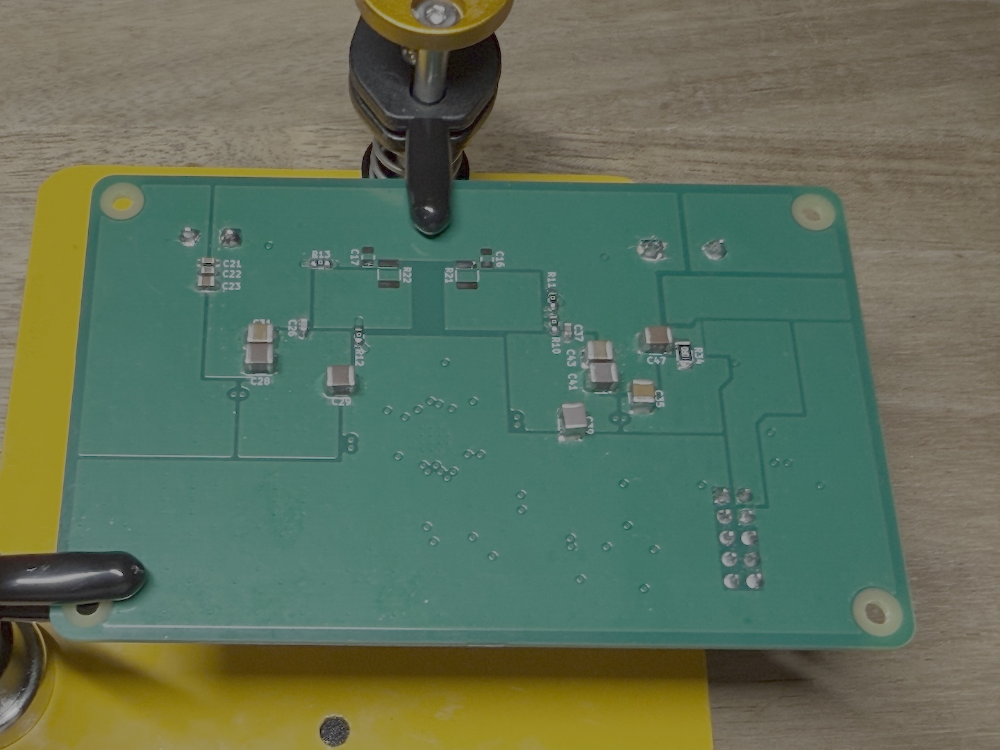

# Building I2C-PPS. Part 8 - Assembly and Smoke Test

 

 

 

At first I tried to assemble the board using T4 solder paste I had on hand, using a plastic card as a squeegee. Even though the paste hadn't expired yet it had been at room temperature for six months and was far too dry to print cleanly. Fun fact - solder paste can only survive till its expiration date if stored at 38 °F (3 °C). The plastic card was also too flexible to control, so I decided to order new paste (this time T5 type) and a set of five stainless steel putty knives in 1" to 5" widths.

As soon as everything arrived I tried to assemble the device again and this time it went incredibly well. Managed to print paste to the board in one pass. The controller in VQFN package wasn’t that hard to place as I expected. But with standard 0.15mm stencil I got a bit more paste for the package pins than I thought was needed. Luckily, it didn't introduce any bridging. Need to consider ordering 0.1mm stencil if board contains less than 1mm wide pads.

Still hit an issue with ordered components during the placement process. I mistakenly ordered LDO in SOT-23-3 instead of SOT-23-5. Fortunately, the device can use 3.3v from external source.

Reflow as well wasn’t that hard with rather cheap hot air station and a hot plate at 245 °F. However, the station didn’t handle biggest capacitors so some help from solder iron was required. Probably, next time for manual assembly it’s better to stick to through-hole electrolytic capacitors, especially for those bigger than 6mm diameter. As bonus they have a bit smaller footprint.

Whole thing took around 8 hours. The first 4 hours went to pick and place on top side and another 4 hours for the rest including reflow, pick and place bottom side, its reflow, and soldering through-hole connectors.

The next day I smoke tested the assembled device. It worked as expected in default mode, the controller responded at 0x6B address and responded correctly to ID request. Unfortunately, I couldn’t get output current readings at first run and figured out later that the controller probably  doesn’t have enough sensitivity for currents less than 400 mA. So need to check this and the next step should be to test whole thing up to its limits with proper load emulation.
