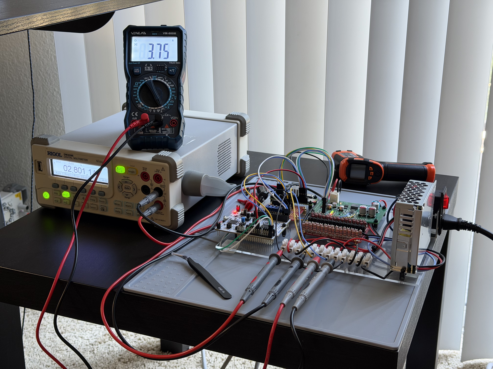
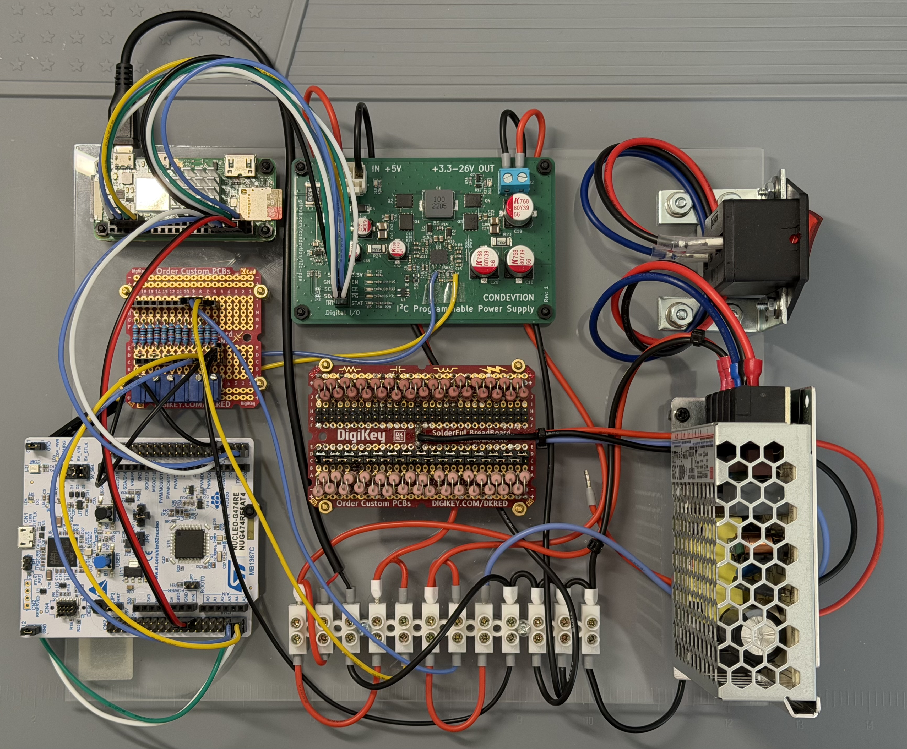
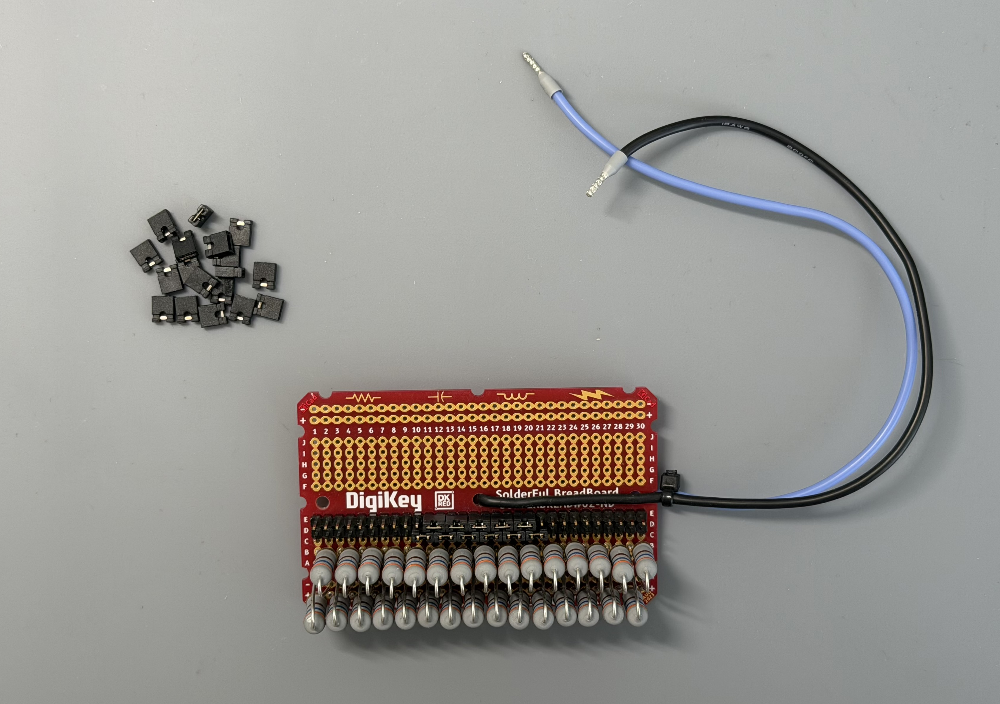
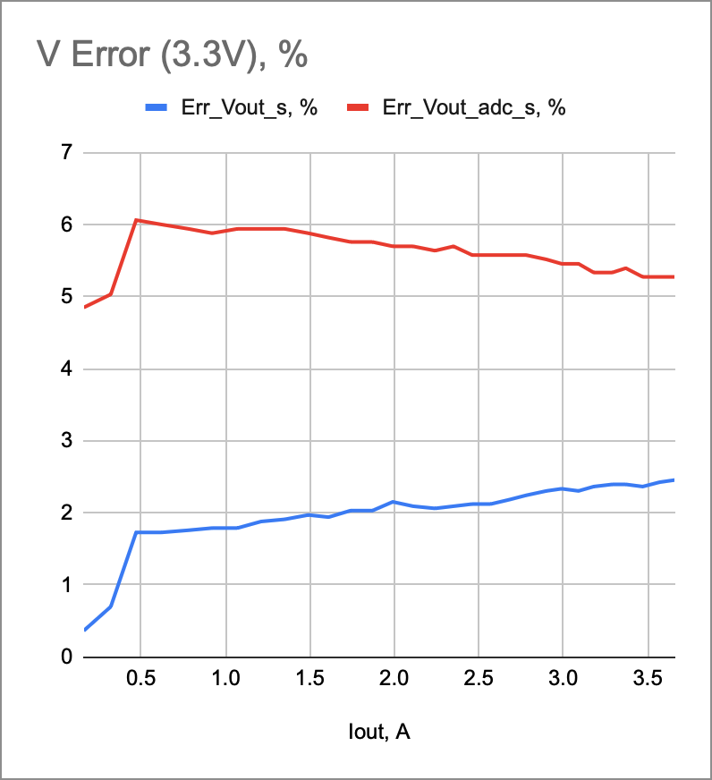
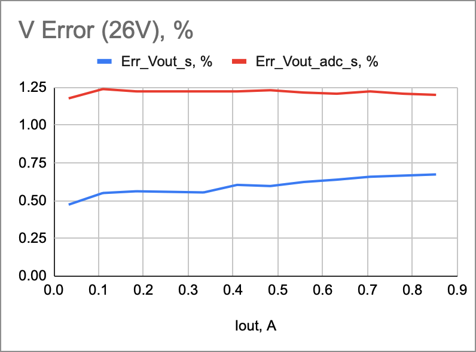
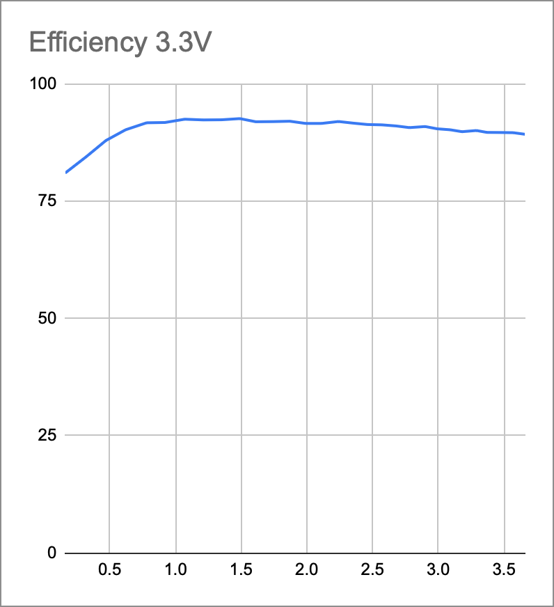
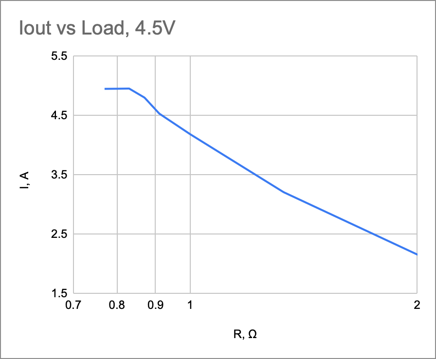
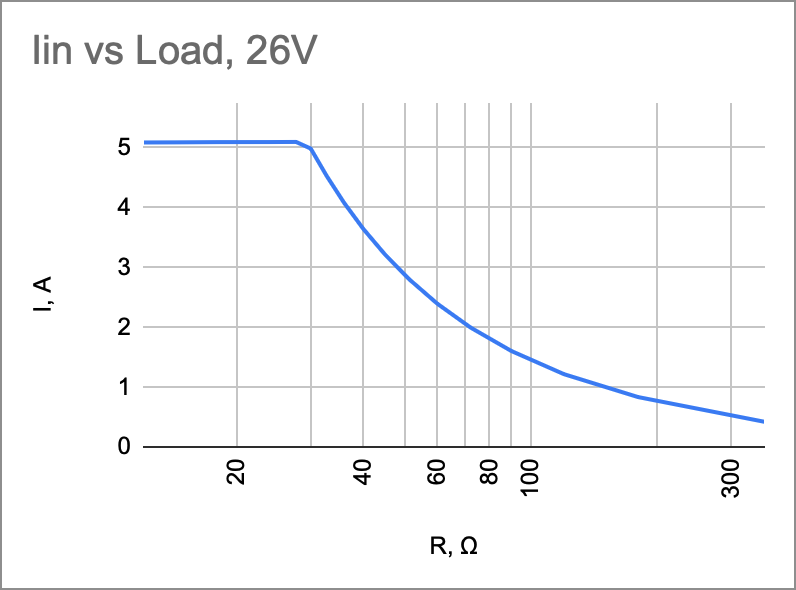

# Building I2C-PPS. Part 9 - Load Test and Project Conclusion

 

 

  

I planned the load test as a final step before wrapping up active work on the power supply project. Let's see where it's ended up. First of all, I mounted all devices on a plexiglass sheet to make the setup handling easier. It consists of MeanWell AC/DC 5V 35W source, Raspberry PI 2 Zero W, NUCLEO-474 and adjustable voltage divider as a 4-channel voltmeter, I2C-PPS itself, load, and a screw terminal to connect all the boards. Additionally, I used two multimeters to independently measure input and output currents. As it appeared later they both had pretty significant resistance to affect high current operation of the power supply.

Initial specification limited output to 25W or 5A (what came first) in 3.3 to 26V range and input current to 5A at 5V. It's pretty demanding numbers. For example, you need just 660 mOhm load to get 5A at 3.3V. As well you'd like to make it adjustable to cover the output current range at different voltages. I decided to hack it with several sets of 2W resistors. Set of 20 Ohm resistors (30 count) covers 3.3-6V range, 43 Ohm - 6-9V, 91 Ohm - 9-13V, 180 Ohm - 13-18V, and 360 Ohm - 18-26V. Each set soldered to a half of a pretty standard 30 position breadboard. Ordinary 100mil jumpers were used to connect necessary number of resistors. Unfortunately, with no active cooling this design becomes really hot within a minute. So I didn't really test reliability of the power supply under significant load.

Still results are quite good for the first revision. The power supply provides requested voltage with around 2% accuracy for 3.3V as controller's datasheet states. Frankly, I got a bit higher than 2% error while the datasheet limited it to 2%, but it's still the first revision. Peak efficiency is 94% at 3.3V and 1.5A down to 87% at 26V and 0.6A. Being overloaded the power supply switches to current limiting mode and properly holds both input and output currents under 5A.

Internal ADC doesn't look that good and shows even higher error (up to 6%) for output voltage. Current sensors disappoint even more. They aren't sensitive to current under 400mA (for analog IIN and IOUT pins) and to current under 1.2A for digital readings. Both showing 10% to 70% error for low currents (but the error goes down significantly for values above 1A). As far as I've dived in it, it works for current limiting within controller specifications but doesn't really suits for measurements. Also the datasheet doesn't mention ADC accuracy so I'd like to think that this is what the controller is designed for - high current applications and safety in the case.

So it really works! While doesn't really suit my small projects needs - lack of output below 3.3V and inaccurate internal sensors for most of my projects, it was really interesting project which put to test my HW design abilities and revealed a lot of fascinating things at every stage from discovering KiCAD features, through selecting parts, ordering and assembling PCB, to emulating load and measuring characteristics of the power supply.
